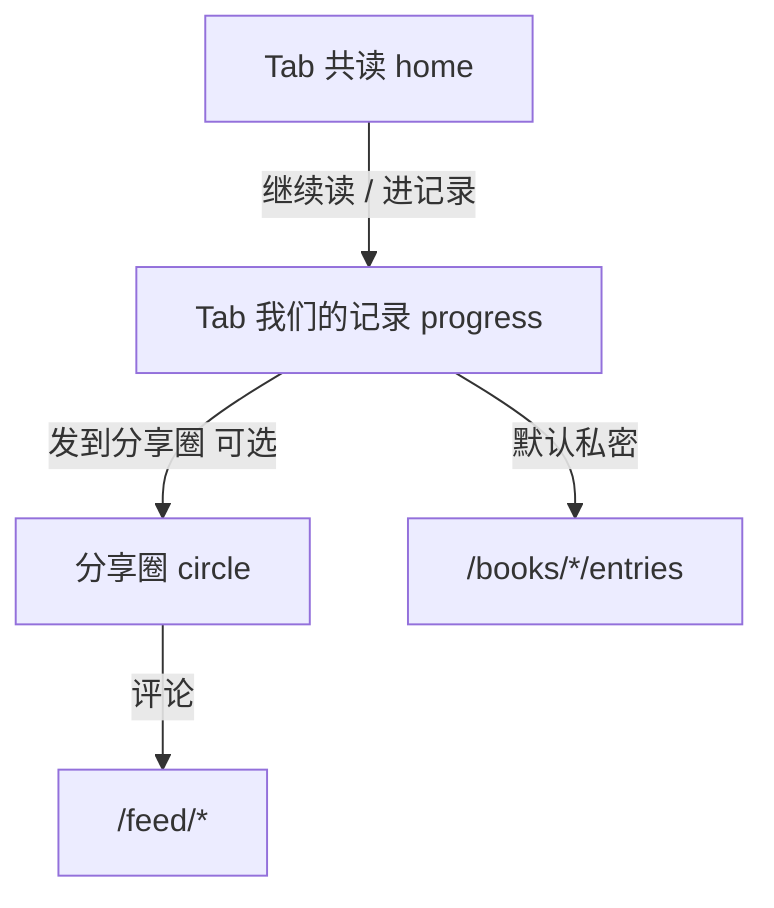

# PRD v1.1：日记情感化与可选分享圈

> 基于 product-discovery / ux-design 工作流整理。默认双人私密，用户主动可选公开。

## 1. 问题陈述

| 问题 | 证据 |
|------|------|
| 首页与日记页信息重复 | 首页 [`pages/home/index.wxml`](../pages/home/index.wxml) 与日记 [`pages/progress/index.wxml`](../pages/progress/index.wxml) 均展示双人进度条 |
| 日记气质偏工具 | 用户感知为「记页码」而非「两个人的情感记录之地」 |
| 公开社区曾延期 | [`record.md`](../record.md) MVP 冻结；现以 **可选公开** 作为二期，不破坏共读闭环 |

## 2. 期望成果（Outcome）

- 用户能清晰区分：**共读**（今日状态） vs **我们的记录**（情感时间线） vs **分享圈**（主动公开的片段）。
- 北极星指标不变：有效共读关系数。
- 新增观测：双向互动率（回复/记录比）、分享圈发布率（二期）。

## 3. 方案对比

| 方案 | 描述 | 优点 | 风险 | 决策 |
|------|------|------|------|------|
| A 仅收敛 IA | 首页瘦身，日记改文案 | 成本低 | 仍缺差异化 | 作为一期基础 |
| B 情感化 + 可选分享圈 | 默认私密 entries；用户发布 excerpt 到 feed | 符合用户选择 | 需 UGC 合规 | **采用** |
| C 强社区 | 默认公开、广场评论 | 增长快 | 审核/隐私/与双人共读冲突 | 不采用 |

## 4. 信息架构

| 模块 | 职责 | 不做 |
|------|------|------|
| 共读 home | 当前书、一句关系化状态、主 CTA | 不展示完整进度条 |
| 我们的记录 progress | 情感时间线、回复、记一笔 | 不承担结伴绑定 |
| 分享圈 circle | 仅 `feed_posts` 已发布内容 | 不同步全部日记 |

## 5. 内容模型（二期）

| 表 | 说明 |
|----|------|
| `feed_posts` | 用户主动从 entry 发布；`entry_id` 唯一；`excerpt` 摘录 |
| `feed_comments` | 分享圈评论 |

默认：`entries` 仍仅 pair 内可见。

## 6. 用户旅程

1. 绑定伙伴 → 选书 → 在「我们的记录」记第一笔 → 伙伴回复 → 可选「发到分享圈」。
2. 分享前二次确认 + 预览摘录（不含锁定/未解锁内容）。

## 7. 微信 UGC 合规清单

- [ ] 用户协议补充：公开内容范围、可被他人评论
- [ ] 隐私政策：公开帖与私密日记区分
- [ ] 举报/删除：作者可删帖；预留 `status=hidden`
- [ ] 发布前确认文案：「仅分享你选中的摘录」
- [ ] 小程序类目与资质评估（社交/论坛类）

## 8. 验收红线（继承 PRD v1.0）

- 主空状态禁止「暂无数据」
- 每屏单一主 CTA
- 异常态给出下一步

## 9. 分期

| 期 | 范围 |
|----|------|
| 一期 | home 瘦身 + progress 情感化 + Tab 文案 |
| 二期 | **仅分享**：生成摘录 → 我的分享 → 微信转发；无评论/广场/举报 |
