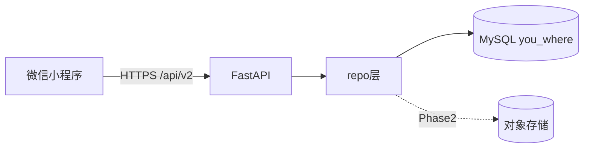

# 你在哪里 — 数据库架构说明

> 版本：与 `backend/common/models.py` 同步（**22** 张业务表）  
> 初始化：`backend/scripts/mysql_init.sql` 或 `python scripts/apply_schema_updates.py`

## 1. 总体原则

| 层级 | 存储 | 说明 |
|------|------|------|
| 微信小程序 | `wx.storage` | 仅 token、少量 UI 缓存；**不建业务库** |
| 服务端 | **1× MySQL** `you_where` | 唯一权威数据源 |
| 可选扩展 | OSS + 只读副本 | 大正文、高并发读；见下文「正文 OSS 演进」 |



---

## 2. 逻辑域（5 块，单库内划分）

### 2.1 账号与会话（2 表）

| 表 | 主键 | 说明 |
|----|------|------|
| `users` | `user_id` | 微信 `open_id`、昵称、头像、`join_code`、`reader_options`(JSON)、可选 `phone_number` |
| `sessions` | `token` | 登录态与 `expires_at` |

**API**：`POST /api/v2/auth/login`、`/auth/phone-login`；`GET/PUT /users/me`

### 2.2 双人关系（2 表）

| 表 | 主键 | 说明 |
|----|------|------|
| `pairs` | `pair_id` | 固定两人；`user_a_id` / `user_b_id` |
| `active_pair_locks` | `user_id` | 每用户最多一个活跃伙伴（并发约束） |

**API**：`POST/DELETE /pairs/current`、`GET /pairs/current`

**枚举 `pairs.status`**：`active` | `unbound`

### 2.3 共读业务（6 表）— 产品核心

| 表 | 主键 | 说明 |
|----|------|------|
| `books` | `book_id` | **按 pair** 的在读书目实例；可关联 `catalog_id` |
| `active_book_locks` | `pair_id` | 每 pair 同时仅一本在读书 |
| `book_switch_requests` | `request_id` | 换书需伙伴同意 |
| `entries` | `entry_id` | 共读日记（页码 + 笔记），`client_request_id` 幂等 |
| `replies` | `reply_id` | 对日记的回复 |
| `read_marks` | `(user_id, book_id)` | 对方未读游标 |

**API**：`POST /books`、`GET /books/{id}/entries`、`POST .../entries`、`POST .../replies`、换书相关 `book-switch-requests`

**枚举 `books.status`**：

| 值 | 含义 |
|----|------|
| `reading` | 共读中 |
| `finished` | 双方读至末页（真读完） |
| `switched` | 中途换书搁置 |

**枚举 `book_switch_requests.status`**：`pending` | `approved` | `rejected`（以代码实际写入为准）

**进度模型**：

- 共读主进度：`entries.page`（按用户、按书取 max）
- 若 `books.catalog_id` 非空，共读进度使用 `book_read_progress` 按 `book_id` 隔离，不复用同一用户在其他伙伴关系里的书城进度。

**业务规则（与代码一致）**：

| 场景 | 规则 | 实现 |
|------|------|------|
| 真读完 | `books.status=finished` 且双方 `effective_user_book_progress >= total_pages` | `book_is_truly_finished()` |
| 换书搁置 | `status=switched`；历史误标 finished 在展示/统计时按 switched 处理 | `_switch_away_reading_book()`、`book_history_display()` |
| 我的页「已读完」统计 | 只计真读完，不含 switched / 误标 finished | `count_truly_finished_books()` |
| 共读目标周期完成册数 | 同上 | `goal_progress()` |
| 阅读历史展示 | `display_status` / `display_label` | `get_reading_history()` |
| 进度页 chips | `my_finished` / `partner_finished` 由 API `book_progress()` 返回 | 与末页比较 |

历史数据修复（可选）：`python scripts/repair_mislabeled_finished_books.py`

### 2.4 书城 / 内容目录（6 表）

| 表 | 主键 | 说明 |
|----|------|------|
| `catalog_books` | `catalog_id` | 书目元数据；`owner_user_id` NULL=公共书城 |
| `catalog_contents` | `catalog_id` | 全文 + 分页元数据（`LONGTEXT`） |
| `catalog_read_progress` | `(user_id, catalog_id)` | 书城阅读器内页码 |
| `catalog_favorites` | `(user_id, catalog_id)` | 收藏 |
| `catalog_reader_marks` | `(user_id, catalog_id, page, para_index)` | 划重点 / 随感 |

**API**：`/api/v2/store/books*`、`import-txt`、`import-url`、收藏、marks、reading-progress

**枚举 `catalog_books.source`（常见）**：

| 值 | 含义 |
|----|------|
| `manifest` | 内置清单 / 特色书单 |
| `project_gutenberg` | 公版种子 |
| `gutendex` | Gutendex 同步元数据 |
| `user_txt` | 用户上传 TXT |
| `user_link` | 用户外链（无本地正文时 `placeholder_pages`） |
| `builtin` | 内置占位（列表可排除） |

**`store_category`**：见 `backend/service/store_categories.py`（如 `fiction`、`classical`、`world_fiction`）

### 2.5 个人设置与运营（3 表）

| 表 | 主键 | 说明 |
|----|------|------|
| `reading_goals` | `user_id` | 共读目标 |
| `reminder_configs` | `user_id` | 提醒开关与时间 |
| `reminder_delivery_logs` | `delivery_id` | 订阅消息投递日志（按日去重） |

**API**：`/users/me/reading-goal`、`/users/me/reminder-config`；脚本 `dispatch_reminders.py`

---

## 3. 表清单（22 张）

| # | 表名 | 域 |
|---|------|-----|
| 1 | users | 账号 |
| 2 | sessions | 账号 |
| 3 | pairs | 关系 |
| 4 | active_pair_locks | 关系 |
| 5 | books | 共读 |
| 6 | active_book_locks | 共读 |
| 7 | book_read_progress | 共读 |
| 8 | book_switch_requests | 共读 |
| 9 | entries | 共读 |
| 10 | replies | 共读 |
| 11 | read_marks | 共读 |
| 12 | catalog_books | 书城 |
| 13 | catalog_contents | 书城 |
| 14 | catalog_read_progress | 书城 |
| 15 | catalog_favorites | 书城 |
| 16 | catalog_reader_marks | 书城 |
| 17 | reading_goals | 设置 |
| 18 | reminder_configs | 设置 |
| 19 | reminder_delivery_logs | 设置 |
| 20 | feed_posts | 分享圈 |
| 21 | feed_comments | 分享圈 |
| 22 | ugc_reports | 合规 |

**关联要点**：`books.catalog_id` → `catalog_books.catalog_id`（可选）；共读实例与书城书目分离，同一 catalog 可被不同 pair 各建一条 book。

---

## 4. 与代码模块映射

| 模块 | 路径 | 主要表 |
|------|------|--------|
| 模型 | `backend/common/models.py` | 全部 |
| 共读 | `backend/repo/reading_repo.py`、`service/reading_service.py` | pairs, books, entries, … |
| 书城 | `backend/repo/store_repo.py`、`service/store_service.py` | catalog_* |
| 分享圈 | `backend/repo/feed_repo.py`、`service/feed_service.py`、`api/v2/feed.py` | feed_posts, feed_comments |
| 个人 | `backend/api/v2/profile.py`、`goals.py`、`reminders.py` | reading_goals, reminder_* |
| 迁移 | `backend/scripts/apply_schema_updates.py` | 增量列补丁 |
| 初始化 | `backend/scripts/mysql_init.sql` | 全量建表 |
| 安全与同步 | `team/database-security.md`、`common/db_safety.py` | 防注入、防误删、结构校验 |

---

## 5. 微信小程序与数据合规

- **采集**：`open_id`（登录必需）、昵称头像（用户授权）、可选手机号。
- **存储位置**：仅服务端 MySQL；客户端不持久化共读正文与用户行为明细。
- **会话**：`sessions` 表；token 过期由接口 401 处理。
- **用户自建书**：`catalog_books.owner_user_id` 非空时，仅本人可访问详情与正文（`assert_can_access_catalog`）。
- **删除/注销**：产品若提供账号注销，需按表级联策略删除或匿名化 `users` 及关联行（当前为预留能力，实施时需补脚本）。

---

## 6. 正文 OSS 演进（Phase 2 容量规划）

### 6.1 何时触发迁移

满足 **任一** 条件即评估将 `catalog_contents.content_text` 迁出 MySQL：

| 指标 | 建议阈值 |
|------|----------|
| `catalog_contents` 表单表大小 | > 2 GB |
| 单条 `content_len` | > 2 MB 且条目 > 50 |
| 备份/恢复耗时 | 全库备份 > 30 min 或影响 SLA |
| InnoDB buffer 压力 | 正文 IO 占磁盘读写主导 |

### 6.2 目标表结构（演进后）

`catalog_contents` 保留分页元数据，正文迁 OSS：

```sql
-- 演进草案（未实施，实施前需迁移脚本 + 回滚方案）
ALTER TABLE catalog_contents
  ADD COLUMN storage_kind VARCHAR(16) NOT NULL DEFAULT 'inline',
  ADD COLUMN content_key VARCHAR(256) NULL,
  MODIFY COLUMN content_text LONGTEXT NULL;
-- storage_kind: inline | oss
-- content_key: 如 oss://bucket/catalog/{catalog_id}.txt
```

**读写路径**：

- `inline`：保持现状，读 `content_text`
- `oss`：`store_service.read_page` 从 OSS 拉取并按 `page_size_chars` 切片（或预分片）

### 6.3 实施步骤（建议顺序）

1. 抽象 `CatalogTextStore` 接口（inline / oss 实现）
2. 新导入书默认写 OSS；旧书后台任务逐步迁移
3. MySQL 中 `content_text` 置 NULL 或删列（最后一步）
4. 静态种子仍可用 `catalog_manifest.json` + 预取任务，不必经 Gutendex

### 6.4 仍保持单库

OSS 只替代 **大字段存储**；`catalog_books`、`catalog_read_progress` 等仍在 MySQL，**不拆第二个业务库**。

---

## 7. 时间字段演进（Phase 2 可选）

当前多数时间为 **ISO8601 字符串 `VARCHAR(64)`**（如 `2026-05-22T12:00:00Z`），与历史 SQLite 兼容。

**评估结论**：见 [`backend/scripts/datetime_migration_eval.md`](../backend/scripts/datetime_migration_eval.md)

- **短期**：维持 VARCHAR，无迁移风险
- **中期**：新表或新列使用 `DATETIME(3)`；旧列分批迁移
- **不建议**：一次性改 19 表全部时间列（停机与回归成本高）

---

## 8. 运维命令速查

```bash
# 新 MySQL 环境
mysql -u ... -p you_where < backend/scripts/mysql_init.sql

# 已有库补丁（create_all + 增量列）
cd backend && python scripts/apply_schema_updates.py

# 环境变量（书城外网）
STORE_ENABLE_NETWORK=0   # 国内机无法稳定访问 gutendex 时建议 0
GUTENDEX_FETCH_TIMEOUT=20
```

---

## 9. 修订记录

| 日期 | 说明 |
|------|------|
| 2026-05-22 | 初版：19 表对齐 mysql_init.sql；五域文档；OSS / 时间字段 Phase2 规划 |
